# Core List

## Main List

| Component | Type   | Description | Model Number | Quantity | Image | Datasheet Link |
|-----------|--------|-------------|--------------|----------------|----------|--|
| FTDI UM-FT2232H       | FTDI USB_to-serial        | Allows for easy interfacing between a USB host and a wide variety of peripheral devices. | UM-FT2232H             | 1     | 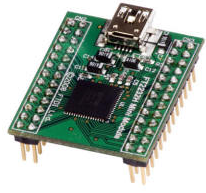     | [Datasheet](https://ftdichip.com/wp-content/uploads/2020/07/DS_FT2232H_Mini_Module.pdf) & [FTDI UM-FT2232H](https://ftdichip.com/products/ft2232h-mini-module/)|
| FTDI USB UART Board   | FTDI Development bopard   | Allows for easy interfacing between a USB host and a wide variety of peripheral devices. |MIKROE-483 Rev 1.10     |  3    | 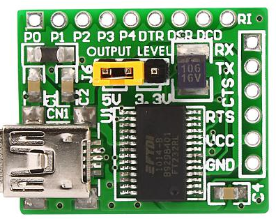     | [Datasheet](https://cdn.soselectronic.com/productdata/88/73/adb7e4e0/usb-uart-board-mikroe-483.pdf) & [FTDI USB UART Board](https://www.soselectronic.com/en-gb/products/mikroelektronika/usb-uart-board-mikroe-483-156641)|
|Small DC Motor         | Motor                     | Litle DC motor from old toy                                                               | -                     | 1     | 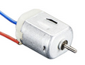     |  -   |
| IR Sensor YL-73       |IR Sensor                  | IR Infrared Patrol Obstacle Avoidance Sensor YL-73                                        | YL-73                 | 1     | 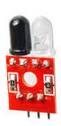     | [Datasheet](https://www.electroschematics.com/sensor-module/)  |
| HFSFSQ-01             |Signal generator           | ICL8038 Monolithic Function Signal Generator Sine Square Triangle                         | HSFSQ-01 with ICL8038 | 1     | 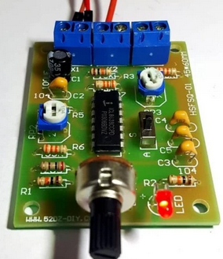     | [HFSFSQ-01](https://www.tokopedia.com/inverterpower/icl8038-monolithic-function-signal-generator-sine-square-triangle?utm_source=google&utm_medium=organic&utm_campaign=pdp-seo) |
|IR Unknown Sensor      | Sensor                    |                                                                                           |                       | 1     | 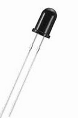     |-|
| 4 Digit Led Display   | Display                   | 4 digits led display with 7 segments each                                                 | SR420561N             | 1     | 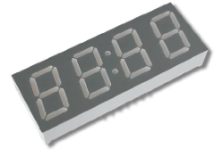     | [Datasheet](https://www.farnell.com/datasheets/2095876.pdf) |
| Step DC Motor 5V      | DC Motor                  | Stepper motor DC 5 5 4-step motor stepping motor                                          | 28BYJ-48              | 1     | 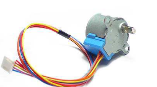     | [Dastasheet](https://www.mouser.com/datasheet/2/758/stepd-01-data-sheet-1143075.pdf?srsltid=AfmBOooMq8kXL06t7RjkTK9rFObdOS10ebn7qlv5G9JIQj66WByfxLC8) |
| ULN2003 Driver Board for 28BYJ-48 | Motor dev board | 5V 12V 4-Phase 28BYJ-48 DC Gear Stepper Motor+ULN2003 Driver Board ULN2003 PIC MCU DIY  | ULN2003               | 1     | 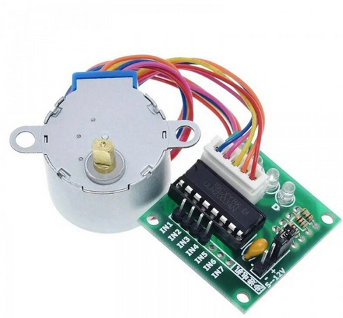    | [Datasheet](https://www.electronicoscaldas.com/datasheet/ULN2003A-PCB.pdf) & [5V 12V 4-Phase 28BYJ-48 DC Gear Stepper Motor+ULN2003 Driver Board ULN2003 PIC MCU DIY](https://www.oyostepper.com/goods-1268-5V-12V-4-Phase-28BYJ-48-DC-Gear-Stepper-MotorULN2003-Driver-Board-ULN2003-PIC-MCU-DIY.html) |
| PIR Sensor            | Movement Sensor           |Movement sensor PIR D203S embedded on simple board with 3 outputs                          | PIR D203S             | 1     | 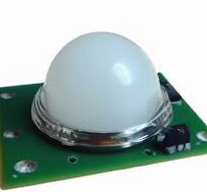 | [Datasheet](https://www.futurlec.com/PIR_D203S.shtml) |
| PIR Sensor with board | Sensor |Movement sensor PIR D203S embedded on simple board with 3 outputs and 2 controlers                            | RPI HC-SR501 & PIR D203S |  1 | 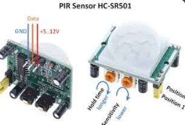|   [Datasheet](https://www.mpja.com/download/31227sc.pdf) |
| Sound Sensor          | Sound Sensor              | Used for Audio amplifier, Ambient sound detection, and Sound level detection              | LM386 + board V2      | 1     | 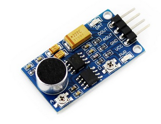| [Datasheet](https://www.waveshare.com/sound-sensor.htm) |
| lcd module 1602a qapass | Display                 | Display without any extra connections                                                     | lcd module 1602a qapass | 1   | 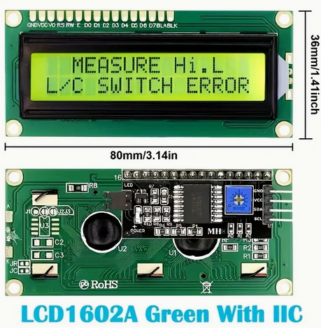 | [Datasheet](https://www.opldisplaytec.com/article/60409) |
| Ultrasonic HC-SR04 Sensor |Ultrasonic Sensor      | Ultrasonic sensor for distance measurement                                                | HC-SR04               | 6     |    | [Datasheet](https://cdn.sparkfun.com/datasheets/Sensors/Proximity/HCSR04.pdf)
| White Breadboard      | Breadboard                | Breadboard for electrical components 640/200                                              | Breadboard            | 1     | 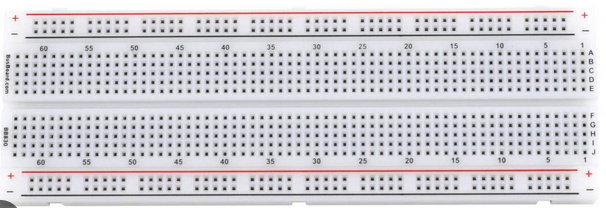 |-|
|I2C Display Module     | Display                   | 16x2 1602 LCD Display Screen Blue + IIC I2C Module datasheet                              | 1602 LCD & I2C        | 1     | 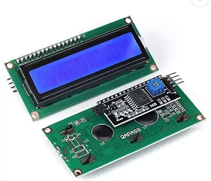 | [Datasheet](https://www.handsontec.com/dataspecs/module/I2C_1602_LCD.pdf) |
| DHT11 Temp & Humidity | Sensor                    | DHT11 Temperature and Humidity Sensor                                                     | DHT11                 | 1     | 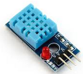| [Datasheet](https://www.mouser.com/datasheet/2/758/DHT11-Technical-Data-Sheet-Translated-Version-1143054.pdf?srsltid=AfmBOoqNOV0kEg4uGLbIXyMZSG76PRf0puS6ClM037xwqhR7fiOJ6Nag) |
| Mini Breadboard       |Breadboard                 | BusBoard Prototype Systems BB170-BK                                                       | BB170-BK              | 2     | 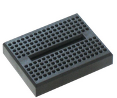 | - |
| Arduino Uno rev 3     | Arduino Microcontroler    |   Arduino microcontroler                                                                  | Arduino Uno           | 1     | 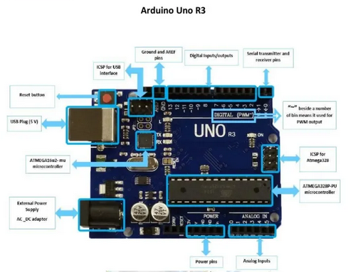 | [Datasheet](https://docs.arduino.cc/hardware/uno-rev3/)|
| USB A to B Cable      |   Cable                   | Cable USB 2.0 A to B.                                                                     | -                     | 1     | 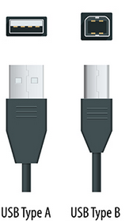 | - |
| BusBoard Prototype    | BreadBoard                | BusBoard Prototype Systems ST1 for welding.                                               | VK C-1160-EP          | 1     | 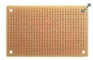 | [Datasheet](https://eu.mouser.com/ProductDetail/BusBoard-Prototype-Systems/ST1?qs=NGErKr1RxMAXV5lcv8OdyQ%3D%3D&srsltid=AfmBOorDSTGXCMWtpnvA05QuGc1nf5CAiwo3zfUN6r1ZG2aXHaXPBi33) |
| 10K variable resitor  | Resistor                  | 10k 056 variable resistor with 3 pins                                                     | 10K 056               | 10    | 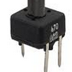 | - |
| 10K 136M variable resistor    | Resistor          | 10K 136M variable resistor with 3 pins                                                    | 10K 136M              | 1     | 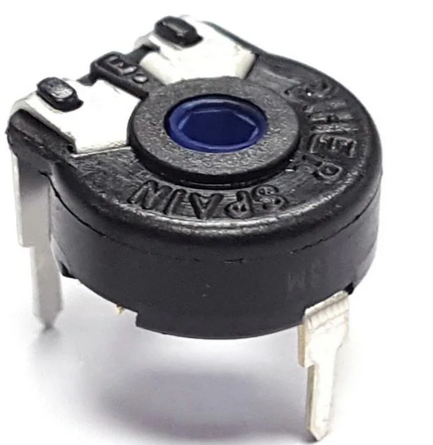 | - |
| 22K variable resistor |   Resistor                | 22K variable resistor with 3 pins                                                         | 22K                   | 2     | 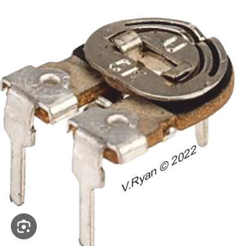 | - |
| 10K Potenciometer     |   Potenciometer           | 10K Ohm Linear Rotary Potentiometer 0.5W                                                  | B10K Ohm              | 2     | 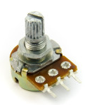 | - |
| Small Button 4P       |   Button                  | Small 4-Pin Tactile Button Switch                                                         | IK                    | 7     | 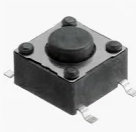 | - |
| Mini Button 4P        |   Button                  | Very small 4-Pin Tactile Button Switch                                                    | IK                    | 10    |  | - |
| 10K Potentiometer     | Potentiometer             | 10 K rotary potentiometer 3 pins                                                          | 3362P-1-102           | 13    | 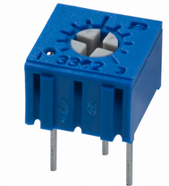 | - |
| MOSFET Transistor     | Transistor                | PBL Mosfet Transistor                                                                     | ALD1103PBL            | 1     | 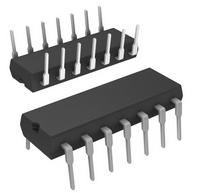 | [Datasheet](https://www.aldinc.com/pdf/ALD1103.pdf) |
| Op Amp TL082CP        | Amplifier                 |Op Amp TL082CP                                                                             | TL082CP               |3      | 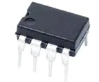 | [Datasheet](https://eu.mouser.com/ProductDetail/Texas-Instruments/TL082CP?qs=3FVjRv9mUZ9wpnudDQ0hww%3D%3D&utm_id=20109199424&gad_source=1&gclid=CjwKCAjw3624BhBAEiwAkxgTOpPXZa-O11-_nXW1ojjTOdY0T3kYqxCTPpEKtY9FFgfXVWkBBxjHGBoCMnUQAvD_BwE) |
| BC547C  Transistor    | Transistor                | Bipolar Transistor BC547C                                                                 | BC547C                | 21    | | [Datasheet](https://www.mouser.ch/ProductDetail/onsemi/BC547C?qs=vLkC5FC1VN9aNDzwWdeJmA%3D%3D&srsltid=AfmBOoouhRH6CDvyYBXrk-TlWGXEDkceyKUb8KHsFpU8vQmks4XFyQh-) |
| Light Sensor          | Sensor                    | Light Sensor                                                                              | 1528-2141-ND          | 4     | 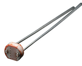 | [Datasheet](https://www.digikey.com/en/products/detail/adafruit-industries-llc/161/7244927) |
| Leds                  | Leds                      | Planty of leds, mostly red, some green and white                                          | -                     |>50    | 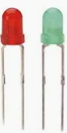 | - |

### Capacitors

| Value                 | Type                      | Description                                                                               | Model Number          | Quantity | Image  | Datasheet Link | 
|-----------------------|---------------------------|-------------------------------------------------------------------------------------------|-----------------------|-------| - | - |
| 100uF                 | Capacitor                 | 100uF Condensador with different Voltages (25-63V) and Temperatures (85-105 Celsius)      |                       | 10    | - | - |
| 8uF                   | Capacitor                 | 8uF Condensador 5V 105 Celsius                                                            |                       | 3     | - | - |
| 47uF                  | Capacitor                 | 47uF Condensador with different voltages (50-63V) and Temperatures (85-105 Celsius)       |                       | 12    | - | - |
| 10uF                  | Capacitor                 | 10uF Condensador with different voltages (63V) and Temperatures (105 Celsius)             |                       | 10    | - | - |
| 1uF                   | Capacitor                 | 1uF Condensador with different voltages (100V) and Temperatures (105 Celsius)             |                       | 5     | - | - |
| 22uF                  | Capacitor                 | 22uF Condensador with different voltages (63V) and Temperatures (105 Celsius)             |                       | 1     | - | - |
| 4.7uF                 | Capacitor                 | 4.7uF Condensador with different voltages (100V) and Temperatures (105 Celsius)           |                       | 1     | - | - |
| 6.8uF                 | Capacitor                 | 6.8uF Condensador with different voltages (50V) and Temperatures (105 Celsius)            |                       | 3     | - | - |
| 1.5uF                 | Capacitor                 | Kondensator 1,5nF M 250V MKT1822 T4                                                       | MKT1822 T4            | 2     | - | - |
| 0.1uF                 | Capacitor                 |   Capacitor                                                                               | B32529C1104J189       | 2     | - | - |
| 15nF                  | Capacitor                 |   Capacitor                                                                               |                       | 2     | - | - |
| 2.2uF                 | Capacitor                 |   Capacitor                                                                               |                       | 1     | - | - |

| 102K                  | Capacitor                 |   Capacitor                                                                               |                       | 1     | - | - |

