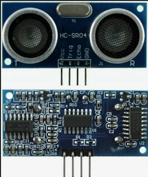

# Core List

## Main List

| Component | Type   | Description | Model Number | Datasheet Link | Quantity | Image |
|-----------|--------|-------------|--------------|----------------|----------|--|
| [FTDI UM-FT2232H](https://ftdichip.com/products/ft2232h-mini-module/) | FTDI USB_to-serial | Allows for easy interfacing between a USB host and a wide variety of peripheral devices. | UM-FT2232H | [Datasheet](https://ftdichip.com/wp-content/uploads/2020/07/DS_FT2232H_Mini_Module.pdf) | 1 | |
| [FTDI USB UART Board](https://www.soselectronic.com/en-gb/products/mikroelektronika/usb-uart-board-mikroe-483-156641) | FTDI Development bopard | Allows for easy interfacing between a USB host and a wide variety of peripheral devices. |MIKROE-483 Rev 1.10 | [Datasheet](https://cdn.soselectronic.com/productdata/88/73/adb7e4e0/usb-uart-board-mikroe-483.pdf) | 1 |  |
|Small DC Motor | Motor | Litle DC motor from old toy | - | - | 1| |
| IR Infrared Patrol Obstacle Avoidance Sensor YL-73 |IR Sensor | Infrared sensor | YL-73 | [Datasheet](https://www.electroschematics.com/sensor-module/) | 1 | |
| [HFSFSQ-01](https://www.tokopedia.com/inverterpower/icl8038-monolithic-function-signal-generator-sine-square-triangle?utm_source=google&utm_medium=organic&utm_campaign=pdp-seo) |Signal generator | ICL8038 Monolithic Function Signal Generator Sine Square Triangle | HSFSQ-01 with ICL8038 | - | 1 |  |
|Black sensor, probably IR | | | | |1| |
| 4 Digit Led Display | Display | 4 digits led display with 7 segments each | SR420561N | [Datasheet](https://www.farnell.com/datasheets/2095876.pdf) | 1 | |
| Step DC Motor 5V | DC Motor | Stepper motor DC 5 5 4-step motor stepping motor | 28BYJ-48 |[Dastasheet](https://www.mouser.com/datasheet/2/758/stepd-01-data-sheet-1143075.pdf?srsltid=AfmBOooMq8kXL06t7RjkTK9rFObdOS10ebn7qlv5G9JIQj66WByfxLC8) |1 | |
| ULN2003 Driver Board for 28BYJ-48 | Motor dev board | [5V 12V 4-Phase 28BYJ-48 DC Gear Stepper Motor+ULN2003 Driver Board ULN2003 PIC MCU DIY](https://www.oyostepper.com/goods-1268-5V-12V-4-Phase-28BYJ-48-DC-Gear-Stepper-MotorULN2003-Driver-Board-ULN2003-PIC-MCU-DIY.html) | ULN2003 | [Datasheet](https://www.electronicoscaldas.com/datasheet/ULN2003A-PCB.pdf) | 1 |  |1 |  |
| PIR Sensor with board | Sensor |Movement sensor PIR D203S embedded on simple board with 3 outputs and 2 controlers|  RPI HC-SR501 & PIR D203S | [Datasheet](https://www.mpja.com/download/31227sc.pdf) | 1 | |
| Sound Sensor | Sound Sensor | Used for Audio amplifier, Ambient sound detection, and Sound level detection  | LM386 + board V2|[Datasheet](https://www.waveshare.com/sound-sensor.htm) | 1 | |
| lcd module 1602a qapass | Display | Display without any extra connections | lcd module 1602a qapass | [Datasheet](https://www.opldisplaytec.com/article/60409) | 1 |  |
| Ultrasonic HC-SR04 Sensor |Ultrasonic Sensor | Ultrasonic sensor for distance measurement | HC-SR04 | [Datasheet](https://cdn.sparkfun.com/datasheets/Sensors/Proximity/HCSR04.pdf) | 6 |    |

