# Core List

List of electronic components.

## Main List

| Number | Component | Type   | Description | Model Number | Quantity | Image | Datasheet Link |
|--------|-----------|--------|-------------|--------------|----------------|----------|--|
|1  | FTDI UM-FT2232H       | FTDI USB_to-serial        | Allows for easy interfacing between a USB host and a wide variety of peripheral devices. | UM-FT2232H             | 1     |      | [Datasheet](https://ftdichip.com/wp-content/uploads/2020/07/DS_FT2232H_Mini_Module.pdf) & [FTDI UM-FT2232H](https://ftdichip.com/products/ft2232h-mini-module/)|
|2  | FTDI USB UART Board   | FTDI Development bopard   | Allows for easy interfacing between a USB host and a wide variety of peripheral devices. |MIKROE-483 Rev 1.10     |  3    | 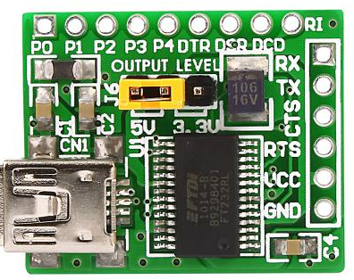     | [Datasheet](https://cdn.soselectronic.com/productdata/88/73/adb7e4e0/usb-uart-board-mikroe-483.pdf) & [FTDI USB UART Board](https://www.soselectronic.com/en-gb/products/mikroelektronika/usb-uart-board-mikroe-483-156641)|
|3  |Small DC Motor         | Motor                     | Litle DC motor from old toy                                                               | -                     | 1     |      |  -   |
|4  | IR Sensor YL-73       |IR Sensor                  | IR Infrared Patrol Obstacle Avoidance Sensor YL-73                                        | YL-73                 | 5     |      | [Datasheet](https://www.electroschematics.com/sensor-module/)  |
|5  | HFSFSQ-01             |Signal generator           | ICL8038 Monolithic Function Signal Generator Sine Square Triangle                         | HSFSQ-01 with ICL8038 | 1     |      | [HFSFSQ-01](https://www.tokopedia.com/inverterpower/icl8038-monolithic-function-signal-generator-sine-square-triangle?utm_source=google&utm_medium=organic&utm_campaign=pdp-seo) |
|6  |IR Unknown Sensor      | Sensor                    |                                                                                           |                       | 1     |      |-|
|7  | 4 Digit Led Display   | Display                   | 4 digits led display with 7 segments each                                                 | SR420561N             | 1     |      | [Datasheet](https://www.farnell.com/datasheets/2095876.pdf) |
|8  | Step DC Motor 5V      | DC Motor                  | Stepper motor DC 5 5 4-step motor stepping motor                                          | 28BYJ-48              | 1     | 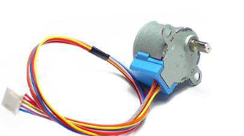     | [Dastasheet](https://www.mouser.com/datasheet/2/758/stepd-01-data-sheet-1143075.pdf?srsltid=AfmBOooMq8kXL06t7RjkTK9rFObdOS10ebn7qlv5G9JIQj66WByfxLC8) |
|9  | ULN2003 Driver Board for 28BYJ-48 | Motor dev board | 5V 12V 4-Phase 28BYJ-48 DC Gear Stepper Motor+ULN2003 Driver Board ULN2003 PIC MCU DIY  | ULN2003               | 1     |     | [Datasheet](https://www.electronicoscaldas.com/datasheet/ULN2003A-PCB.pdf) & [5V 12V 4-Phase 28BYJ-48 DC Gear Stepper Motor+ULN2003 Driver Board ULN2003 PIC MCU DIY](https://www.oyostepper.com/goods-1268-5V-12V-4-Phase-28BYJ-48-DC-Gear-Stepper-MotorULN2003-Driver-Board-ULN2003-PIC-MCU-DIY.html) |
|10 | PIR Sensor            | Movement Sensor           |Movement sensor PIR D203S embedded on simple board with 3 outputs                          | PIR D203S             | 1     | 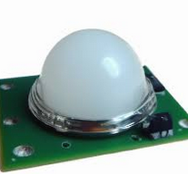 | [Datasheet](https://www.futurlec.com/PIR_D203S.shtml) |
|11 | PIR Sensor with board | Sensor |Movement sensor PIR D203S embedded on simple board with 3 outputs and 2 controlers                            | RPI HC-SR501 & PIR D203S |  1 | 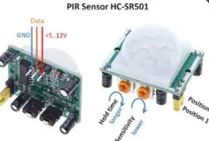|   [Datasheet](https://www.mpja.com/download/31227sc.pdf) |
|12 | Sound Sensor          | Sound Sensor              | Used for Audio amplifier, Ambient sound detection, and Sound level detection              | LM386 + board V2      | 2     | | [Datasheet](https://www.waveshare.com/sound-sensor.htm) |
|13 | lcd module 1602a qapass | Display                 | Display without any extra connections                                                     | lcd module 1602a qapass | 1   |  | [Datasheet](https://www.opldisplaytec.com/article/60409) |
|14 | Ultrasonic HC-SR04 Sensor |Ultrasonic Sensor      | Ultrasonic sensor for distance measurement                                                | HC-SR04               | 7     |    | [Datasheet](https://cdn.sparkfun.com/datasheets/Sensors/Proximity/HCSR04.pdf)
|15 | White Breadboard      | Breadboard                | Breadboard for electrical components 640/200                                              | Breadboard            | 4     | 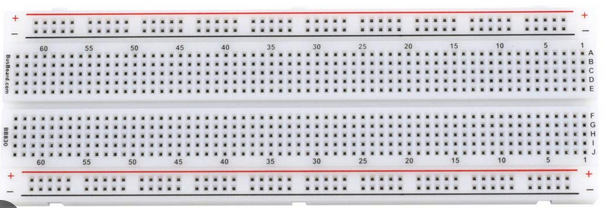 |-|
|16 |I2C Display Module     | Display                   | 16x2 1602 LCD Display Screen Blue + IIC I2C Module datasheet                              | 1602 LCD & I2C        | 1     |  | [Datasheet](https://www.handsontec.com/dataspecs/module/I2C_1602_LCD.pdf) |
|17 | DHT11 Temp & Humidity | Sensor                    | DHT11 Temperature and Humidity Sensor with board                                          | DHT11                 | 2     | 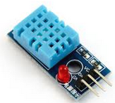| [Datasheet](https://www.mouser.com/datasheet/2/758/DHT11-Technical-Data-Sheet-Translated-Version-1143054.pdf?srsltid=AfmBOoqNOV0kEg4uGLbIXyMZSG76PRf0puS6ClM037xwqhR7fiOJ6Nag) |
|18 | DHT11 Temp & Hum      |   Sensor                  | DHT11 Temperature and humidity sensor                                                     | DHT11                 | 1     | 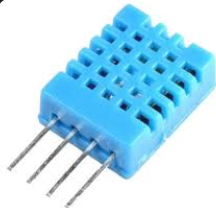 | [Datasheet](https://www.mouser.com/datasheet/2/758/DHT11-Technical-Data-Sheet-Translated-Version-1143054.pdf?srsltid=AfmBOoqiGzMEGoiD9HBOapVWZQr1lfrG2GEt2gv8VkAbt_P-xlpA-Zy2) |
|19 | Mini Breadboard       |Breadboard                 | BusBoard Prototype Systems BB170-BK. One black and 2 red.                                 | BB170-BK              | 3     | 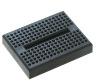 | - |
|20 | Arduino Uno rev 3     | Arduino Microcontroler    |   Arduino microcontroler                                                                  | Arduino Uno           | 1     |  | [Datasheet](https://docs.arduino.cc/hardware/uno-rev3/)| 
|21 | USB A to B Cable      |   Cable                   | Cable USB 2.0 A to B.                                                                     | -                     | 1     | 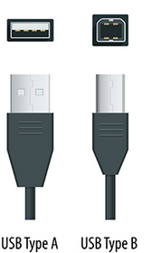 | - |
|22 | BusBoard Prototype    | BreadBoard                | BusBoard Prototype Systems ST1 for welding.                                               | VK C-1160-EP          | 1     | 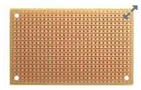 | [Datasheet](https://eu.mouser.com/ProductDetail/BusBoard-Prototype-Systems/ST1?qs=NGErKr1RxMAXV5lcv8OdyQ%3D%3D&srsltid=AfmBOorDSTGXCMWtpnvA05QuGc1nf5CAiwo3zfUN6r1ZG2aXHaXPBi33) |
|23 | 10K variable resitor  | Resistor                  | 10k 056 variable resistor with 3 pins                                                     | 10K 056               | 12    |  | - |
|24 | 10K 136M variable resistor    | Resistor          | 10K 136M variable resistor with 3 pins                                                    | 10K 136M              | 2     | 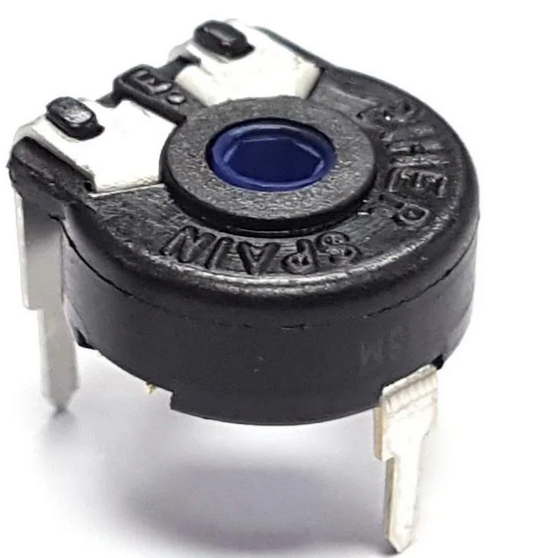 | - |
|25 | 22K variable resistor |   Resistor                | 22K variable resistor with 3 pins                                                         | 22K                   | 3     |  | - |
|26 | 10K Potenciometer     |   Potenciometer           | 10K Ohm Linear Rotary Potentiometer 0.5W                                                  | B10K Ohm              | 3     | 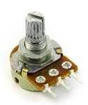 | - |
|27 | Small Button 4P       |   Button                  | Small 4-Pin Tactile Button Switch                                                         | IK                    | 10     | 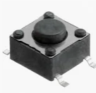 | - |
|28 | Mini Button 4P        |   Button                  | Very small 4-Pin Tactile Button Switch                                                    | IK                    | 10    |  | - |
|29 | 10K Potentiometer     | Potentiometer             | 10 K rotary potentiometer 3 pins                                                          | 3362P-1-102           | 13    |  | - |
|30 | MOSFET Transistor     | Transistor                | PBL Mosfet Transistor                                                                     | ALD1103PBL            | 1     | 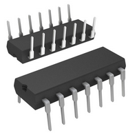 | [Datasheet](https://www.aldinc.com/pdf/ALD1103.pdf) |
|31 | Op Amp TL082CP        | Amplifier                 |Op Amp TL082CP                                                                             | TL082CP               |4      | 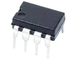 | [Datasheet](https://eu.mouser.com/ProductDetail/Texas-Instruments/TL082CP?qs=3FVjRv9mUZ9wpnudDQ0hww%3D%3D&utm_id=20109199424&gad_source=1&gclid=CjwKCAjw3624BhBAEiwAkxgTOpPXZa-O11-_nXW1ojjTOdY0T3kYqxCTPpEKtY9FFgfXVWkBBxjHGBoCMnUQAvD_BwE) |
|32 | BC547C  Transistor    | Transistor                | Bipolar Transistor BC547C                                                                 | BC547C                | 36    | | [Datasheet](https://www.mouser.ch/ProductDetail/onsemi/BC547C?qs=vLkC5FC1VN9aNDzwWdeJmA%3D%3D&srsltid=AfmBOoouhRH6CDvyYBXrk-TlWGXEDkceyKUb8KHsFpU8vQmks4XFyQh-) |
|33 | BC557C  Transistor    | Transistor                | Bipolar Transistor BC557C                                                                 | BC545C                | 31    | | - |
|34 | Light Sensor          | Sensor                    | Light Sensor                                                                              | 1528-2141-ND          | 9     |  | [Datasheet](https://www.digikey.com/en/products/detail/adafruit-industries-llc/161/7244927) |
|35 | Leds                  | Leds                      | Planty of leds, mostly red, some green and white                                          | -                     |>50    | 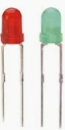 | - |
|36 | On-Off Switch 3P      | Switch                    | On-off switch 3 pins. Some in bad state.                                                  |                       | 3     |  | - |
|37 | On-Off Switch 6P      | Switch                    | on-off switch 6 pins.                                                                     |                       | 2     | 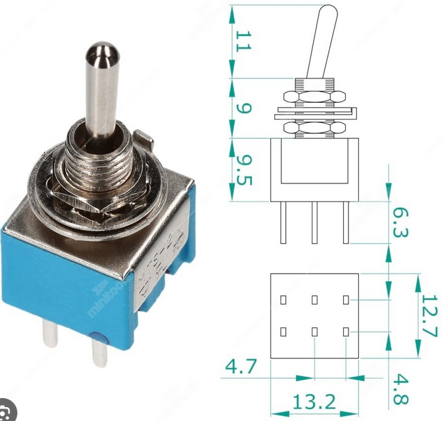 | - |
|38 | Buzzer                | Buzzer                    | Simple buzzer                                                                             |                       | 1     |  | - |
|39 | 1 Digit Led Display   | Display                   | One digit with 7 segments display.                                                        |                       | 1     |  | - |
|40 | Shift Register        | Shift Register            | 8-bit shift registers with 3-state output registers                                       | SN74HC595             | 1     |    | [Datasheet](https://www.ti.com/lit/ds/symlink/sn74hc595.pdf?ts=1728807322546&ref_url=https%253A%252F%252Fwww.mouser.de%252F) |
|41 | Remote Controller IR  | IR Sensor                 | Universal IR Infrared Receiver Sensor Module 1838 TL1838 VS1838B 38Khz Diode CHQ1838      | OS-1838               | 1     |  |- |
|42 | Mercury Ball Tilt Switch | Switch                 | Mercury Ball Tilt Switch                                                                  |                       | 2     |  | - |
|43 | Temperature Sensor    | Sensor                    | DALLAS DS18B20 18B20 TO-92 IC CHIP Thermometer Temperature Sensor                         | DS18B20               | 1     |  | [Datasheet](https://www.alldatasheet.com/datasheet-pdf/pdf/58559/DALLAS/18B20.html)|
|44 | NPN Transistor        | Transistor                | NPN Bipolar Transistor                                                                    | BD681                 | 10    |  | [Datasheet](https://za.rs-online.com/web/p/darlington-pairs/1024093) |
|45 | Compass               | Sensor                    | GY-273 HMC5883L 3-Axis Magnetic Electronic Compass                                        | HMC5883L              | 1     |  |[Datasheet](https://www.robotpark.com/GY-273-HMC5883L-3-Axis-Magnetic-Electronic-Compass) |
|46 | RS-232 Male           | Connector                 | RS-232 Male to male adapter.                                                              | RS-232                | 1     |  | - |
|47 | LM393 Flame Detector  | Sensor                    | LM393 Flame Detector Sensor Module                                                        | LM393                 | 2     |  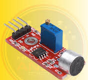 | - |
|48 | nRF 24L01+ Module     | Wireless Module           | nRF 24L01+ Transceiver and receiver modules                                               | nRF24L01+             | 2     |   | [Link](https://wolles-elektronikkiste.de/en/nrf24l01-2-4-ghz-radio-modules)
|49 | Arduino Nano          | Microcontroller           | Arduino Nano Microcontroller                                                              | ATmega 328            | 2     |  | - |
|50 | nRF52840 Dongle       |Wireless Dongle            | Wireless dongle nRF52840                                                                  | nRF52840              | 1     |  | [Link](https://www.nordicsemi.com/Products/Development-hardware/nRF52840-Dongle) |
|51 | DS0138 Osciloscope    |Osciloscope                | DSO 138 Oscilloscope DIY Kit                                                              | DS0138                | 1     |    | [Datasheet](https://jyetech.com/wp-content/uploads/2018/07/dso138-user-manual-13803k-13804k.pdf) |
|52 | Buttons Miscellaneous | Buttons                   | Small Buttons with different configurations                                               | -                     | 5     | - | - |
|53 | BC547B  Transistor    | Transistor                | Bipolar Transistor BC547B                                                                 | BC547B                | 8     | | - |
| 54 | C557B Transister     | Transister                | PNP General Purpose Transistor                                                            | C557B                 | 2     | - |   [Datasheet](https://www.alldatasheet.com/datasheet-pdf/pdf/153932/WEITRON/C557B.html) |
| IRF Tranisistor           | Transistor                |IRF840 Transistor                                                                          | IRF840                | 9     |  | [Datasheet](https://www.alldatasheet.com/datasheet-pdf/pdf/3045/MOTOROLA/IRF840.html)|
|55 | Miscellaneous Potenciometer     |   Potenciometer | Miscellaneous Potenciometer (100, 220, 1K, 2k2)                                           |                       | 4     |  | - |
|56 | Servo Motor           | DC Motor                  | Servo Motor                                                                               | SG90                  | 4     |  | - |
|57 | Digital Voltimeter    |   Voltimeter              | DSN-DVM-368 digital voltmeter                                                             | DSN-DVM-368           | 1     |  | - |
|58 | 6V 4.5Ah Battery      | Battery                   | Lead-Acid Rechargeable Battery RB640BS 6V, 4.5Ah                                          | RB640S                | 1     |  | - |
|59 | 4×3 Membrane Keypad   | KeyPad                    | 4×3 Membrane Keypad                                                                       | -                     | 1     |  | - |
|60 | Small Solar Panel     | Solar Panel               | SOLAR-112, 1.1 Watt Solar Panel 6V 200mA, 112 X 84 mm                                     | -                     | 1     |  | - |
|61 | NodeMCU ESP8266       | Microcontroller           | Lua based firmware and development board specially targeted for IoT based Applications    | ESP8266               | 1     |  | [Datasheet](https://components101.com/development-boards/nodemcu-esp8266-pinout-features-and-datasheet) |
|62 | L293D Motor Driver    | IC                        | 16-pin Motor Driver IC which can control a set of two DC motors simultaneously in any direction. | L293D          | 2     |  | - |
|63 | Piezo                 | Sensor                    | Piezo alike CEB-27D44                                                                     |  CEB-27D44            |   10  |  | [Datasheet](https://www.sameskydevices.com/product/resource/ceb-27d44.pdf) | 
|64 | HP-3060 Cable         |   Cable                   | HP-3060 Cabple to measure electronics.                                                    | HP-3060               | 2     |  | - |
|65 | HW-131 Breadboard     | Module                    | Mini Power Supply Module HW-131 Breadboard Power Module                                   | HW-131                | 2     |  | [Datasheet](https://www.majju.pk/product/5v-power-supply-for-breadboard-mb-102/) |
|66 | 4 Relay Module        |  Module                   | 4 Relay Module                                                                            | -                     | 1     |  | [Datasheet](https://www.handsontec.com/dataspecs/4Ch-relay.pdf) | 
|67 | ar mp3 IR remote      | Remote Controller         | IR Remote COntroller ar mp3                                                               | ar mp3                | 1     |  | - |

* Plenty resistors
* Plenty diodies
* Miscelaneous capacitors

### Resistors
| Value                 | Type                      | Description                                                                               | Model Number          | Quantity | Image  | Datasheet Link | 
|-----------------------|---------------------------|-------------------------------------------------------------------------------------------|-----------------------|----------| ------ | -------------- |
| 1M                    | Resistor                  | Normal Resistor                                                                           | -                     | 5        | -      |                |
| 1K                    | Resistor                  | Normal Resistor                                                                           | -                     | 20       | -      |                |
| 10M                   | Resistor                  | Normal Resistor                                                                           | -                     | 21       | -      |                |
| 200K                  | Resistor                  | Normal Resistor                                                                           | -                     | 18       | -      |                |
| 10K                   | Resistor                  | Normal Resistor                                                                           | -                     | 15       | -      |                |

### Capacitors

| Value                 | Type                      | Description                                                                               | Model Number          | Quantity | Image  | Datasheet Link | 
|-----------------------|---------------------------|-------------------------------------------------------------------------------------------|-----------------------|-------| - | - |
| 100uF                 | Capacitor                 | 100uF Condensador with different Voltages (25-63V) and Temperatures (85-105 Celsius)      |                       | 12    | - | - |
| 8uF                   | Capacitor                 | 8uF Condensador 5V 105 Celsius                                                            |                       | 3     | - | - |
| 47uF                  | Capacitor                 | 47uF Condensador with different voltages (50-63V) and Temperatures (85-105 Celsius)       |                       | 12    | - | - |
| 10uF                  | Capacitor                 | 10uF Condensador with different voltages (63V) and Temperatures (105 Celsius)             |                       | 10    | - | - |
| 1uF                   | Capacitor                 | 1uF Condensador with different voltages (100V) and Temperatures (105 Celsius)             |                       | 5     | - | - |
| 22uF                  | Capacitor                 | 22uF Condensador with different voltages (63V) and Temperatures (105 Celsius)             |                       | 1     | - | - |
| 4.7uF                 | Capacitor                 | 4.7uF Condensador with different voltages (100V) and Temperatures (105 Celsius)           |                       | 1     | - | - |
| 6.8uF                 | Capacitor                 | 6.8uF Condensador with different voltages (50V) and Temperatures (105 Celsius)            |                       | 3     | - | - |
| 1.5uF                 | Capacitor                 | Kondensator 1,5nF M 250V MKT1822 T4                                                       | MKT1822 T4            | 2     | - | - |
| 0.1uF                 | Capacitor                 |   Capacitor                                                                               | B32529C1104J189       | 2     | - | - |
| 15nF                  | Capacitor                 |   Capacitor                                                                               |                       | 2     | - | - |
| 2.2uF                 | Capacitor                 |   Capacitor                                                                               |                       | 1     | - | - |
| 102K                  | Capacitor                 |   Capacitor                                                                               |                       | 1     | - | - |
| 470uF                 | Capacitor                 |   Capacitor  (63V 105Celsius)                                                             |                       | 10    | - | - |
| 220uF                 | Capacitor                 |   Capacitor  (63V 105Celsius)                                                             |                       | 1     | - | - |
| 3u3 K                 | Capacitor                 |   Capacitor  (100 V 368 MKT (ME))                                                         |                       | 1     | - | - |

